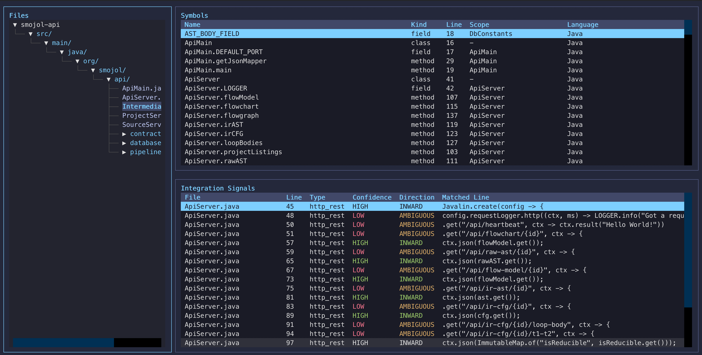
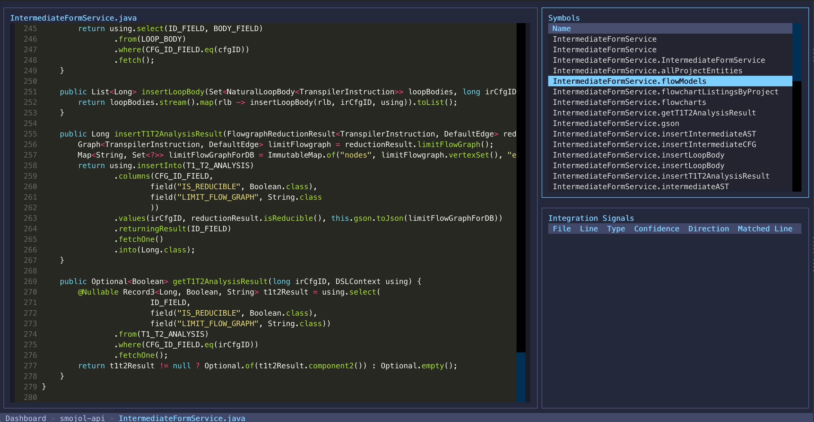
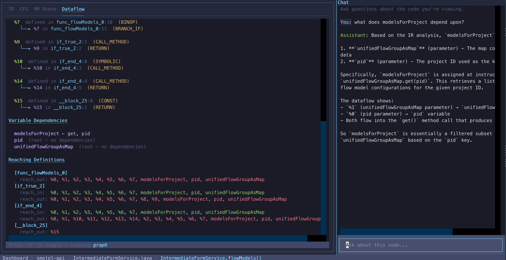
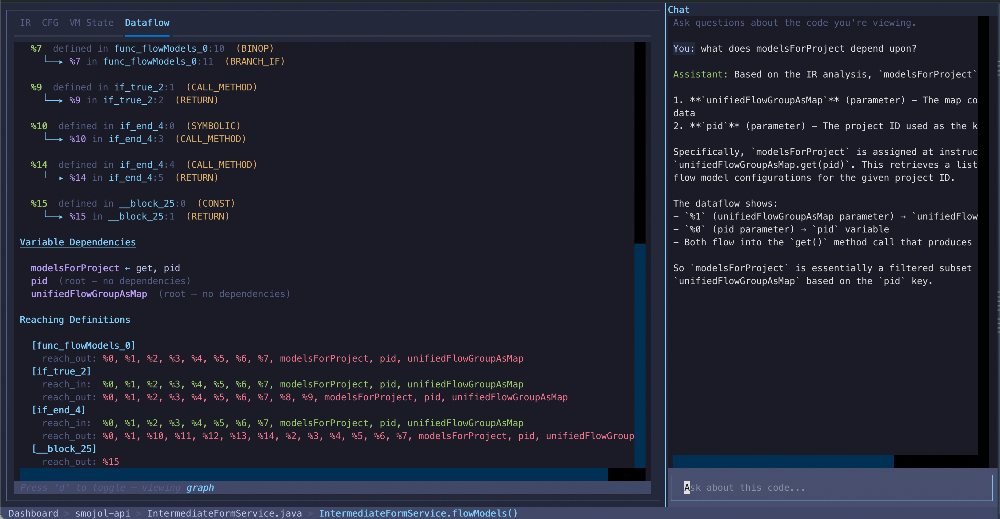
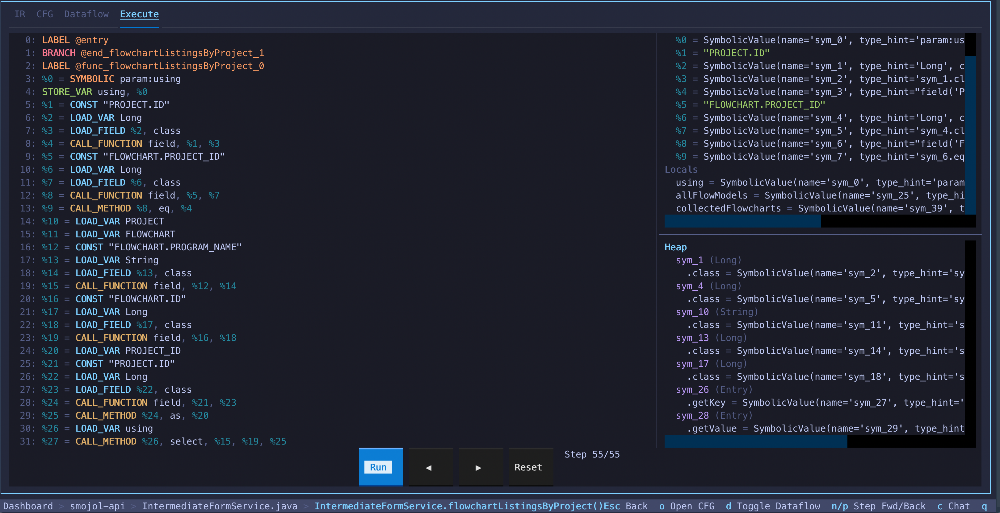

# Rev-Eng TUI

[](https://github.com/avishek-sen-gupta/reddragon-codescry-tui/actions/workflows/ci.yml)
[](LICENSE.md)

A top-down, read-only, multi-repo reverse engineering terminal UI that integrates [Codescry](https://github.com/avishek-sen-gupta/codescry) (repo surveying, integration detection, symbol resolution, BGE embedding concretisation) and [Red Dragon](https://github.com/avishek-sen-gupta/red-dragon) (symbolic execution, IR lowering, CFG generation, dataflow analysis).

[Philosophy](PHILOSOPHY.md)

## Demo


## Screenshots

### Repo Explorer

> File tree, symbol table, and integration signals with confidence/direction coloring.

### File Viewer

> Syntax-highlighted source with file-scoped symbols and integration signals.

### Function Analysis — Dataflow + Chat

> Def-use chains, variable dependencies, reaching definitions, and LLM-powered contextual Q&A.

### Function Analysis — Chat

> Ask questions about the function — the LLM has full context of IR, dataflow, and VM state.

### Function Analysis — Execute

> Step-by-step execution replay with IR highlighting, Frame (registers + locals) and Heap (objects + path conditions) in side-by-side panes.

## What it does

Engineers exploring unfamiliar codebases can drill down from a high-level overview to function-level symbolic execution, with an LLM chat pane for contextual questions.

```
DashboardScreen ──Enter──▸ RepoScreen ──Enter──▸ FileScreen ──Enter──▸ FunctionScreen ──c──▸ ChatScreen
(list all repos)          (file tree +          (source code +       (IR, CFG, VM state,   (full-width
                           symbols +             symbols +            dataflow, execute     LLM chat)
                           integrations)         integrations)        tabs)

                           Escape goes back one screen at each level
```

### DashboardScreen
- Multi-repo overview from a JSON config
- Summary panel showing languages, frameworks, integration count

### RepoScreen
- File tree built from CTags symbols
- Symbol table (name, kind, line, scope, language)
- Integration signals table with confidence/direction coloring and matched line content
- BGE embedding concretisation for signal classification (when enabled)

### FileScreen
- Syntax-highlighted source viewer (background-loaded for responsiveness)
- File-scoped symbols and integration signals

### FunctionScreen
- **IR tab**: Color-coded three-address code instructions with opcode-based styling
- **CFG tab**: Colored text-based control flow graph with block labels, T/F edge labels for conditionals, entry block highlighting. Press `o` to render Red Dragon's Mermaid CFG as a PNG and open externally
- **Dataflow tab**: Def-use chains and variable dependencies (press `d` to toggle table/graph view)
- **Execute tab**: Step-by-step execution replay — IR listing with current instruction highlighted, Frame (registers + locals) and Heap (objects with expanded fields + path conditions) side-by-side in independently scrollable panes. Press `n`/`p` to step forward/backward through the execution trace

### ChatScreen
- Full-width LLM-powered contextual Q&A overlay (press `c` from FunctionScreen, `Escape` to return)
- Has full context of IR, dataflow, VM state, and survey bundle for the current function

## Setup

### Prerequisites
- Python 3.13+
- [Poetry](https://python-poetry.org/)
- [Node.js](https://nodejs.org/) (for Mermaid CLI CFG rendering via `npx`)

### Install

```bash
git clone https://github.com/avishek-sen-gupta/reddragon-codescry-tui.git rev-eng-tui
cd rev-eng-tui
poetry install          # core dependencies only
poetry install --with ml  # include Codescry + Red Dragon analysis engines
```

Codescry and Red Dragon are in the optional `ml` dependency group. Install with `--with ml` to enable full analysis capabilities.

### Configure

```bash
cp config/repos.example.json config/repos.json
# Edit repos.json with your repo paths
```

### Run

```bash
poetry run retui --config config/repos.json
```

## Configuration

```json
{
  "version": 1,
  "repos": [
    {"name": "my-service", "path": "/code/svc", "languages": ["Java"], "auto_survey": true}
  ],
  "session_dir": "~/.rev-eng-tui/sessions",
  "llm": {"model": "anthropic/claude-sonnet-4-20250514", "api_key_env": "ANTHROPIC_API_KEY"},
  "embedding": {"enabled": true, "model": "BAAI/bge-base-en-v1.5", "threshold": 0.62},
  "neo4j": {"enabled": false}
}
```

The `llm.model` field uses [LiteLLM's provider/model format](https://docs.litellm.ai/docs/providers), enabling any supported provider:
- `anthropic/claude-sonnet-4-20250514` (set `ANTHROPIC_API_KEY`)
- `openai/gpt-4o` (set `OPENAI_API_KEY`)
- `gemini/gemini-2.0-flash` (set `GEMINI_API_KEY`)
- `ollama/llama3` (local, no API key needed)

## Keybindings

| Key | Action |
|-----|--------|
| `Enter` | Drill into selected item |
| `Escape` | Go back one screen |
| `q` | Quit |
| `o` | Open CFG as rendered PNG in system viewer (FunctionScreen) |
| `d` | Toggle dataflow table/graph view (FunctionScreen) |
| `n` | Step forward in execution trace (FunctionScreen Execute tab) |
| `p` | Step backward in execution trace (FunctionScreen Execute tab) |
| `c` | Open LLM chat screen (FunctionScreen) |
| Arrow keys | Navigate tables and trees |

## Architecture

### Analysis Pipeline

The TUI delegates all analysis to two libraries:

- **Codescry** (`repo_surveyor`): `survey()` scans a repo and returns CTags symbols, integration signals, resolution results, and concretisation. Optionally runs BGE embedding concretisation via `PatternEmbeddingConcretiser` for signal classification.
- **Red Dragon** (`interpreter`): `lower_source()` parses and lowers code to IR. `build_cfg_from_source()` builds a function-scoped CFG. `dump_mermaid()` generates Mermaid flowcharts. `execute_traced()` performs symbolic execution with per-step VMState snapshots for replay. `analyze()` computes dataflow (def-use chains, reaching definitions). `extract_function_source()` uses tree-sitter AST parsing to extract function bodies from source files.

The `AnalysisFacade` (`facade/analysis.py`) unifies both libraries into a single cached API. Function-level analysis uses Red Dragon's API to scope the CFG to just the selected function via `extract_function_instructions()`.

### CFG Rendering

CFG visualisation uses Red Dragon's built-in `dump_mermaid()` which generates Mermaid flowchart syntax with function/class subgraphs, T/F edge labels, call edges, and dead code elimination. When opened externally (`o`), the Mermaid output is rendered to PNG via `npx @mermaid-js/mermaid-cli`. The in-terminal view shows a colored text representation of the CFG blocks and edges.

### Session Persistence

Survey results, function analysis, chat history, and navigation state are persisted to `~/.rev-eng-tui/sessions/` as JSON/JSONL files.

## Dependencies

### Python (installed via Poetry)
- **[Codescry](https://github.com/avishek-sen-gupta/codescry)**: Repo surveying, CTags, integration detection, BGE embedding concretisation
- **[Red Dragon](https://github.com/avishek-sen-gupta/red-dragon)**: Tree-sitter parsing, IR lowering, CFG/Mermaid generation, dataflow analysis, symbolic execution
- **[Textual](https://textual.textualize.io/)**: TUI framework
- **[LiteLLM](https://docs.litellm.ai/)**: Multi-provider LLM API (supports Anthropic, OpenAI, Gemini, Ollama, and more)
- **[sentence-transformers](https://www.sbert.net/)**: BGE embedding model
- **[Pydantic](https://docs.pydantic.dev/)**: Configuration models

### System
- **[Node.js](https://nodejs.org/)**: Required for `npx @mermaid-js/mermaid-cli` (CFG PNG rendering)

## Tests

```bash
poetry run pytest tests/ -v
```

## Recording a demo

For a video demo, [asciinema](https://asciinema.org/) works well for terminal recordings:

```bash
brew install asciinema
asciinema rec docs/demo.cast
# Run the TUI, navigate through screens, then exit with q and Ctrl-D
asciinema upload docs/demo.cast
```

Alternatively, use macOS screen recording (`Cmd+Shift+5`) or [OBS](https://obsproject.com/).
